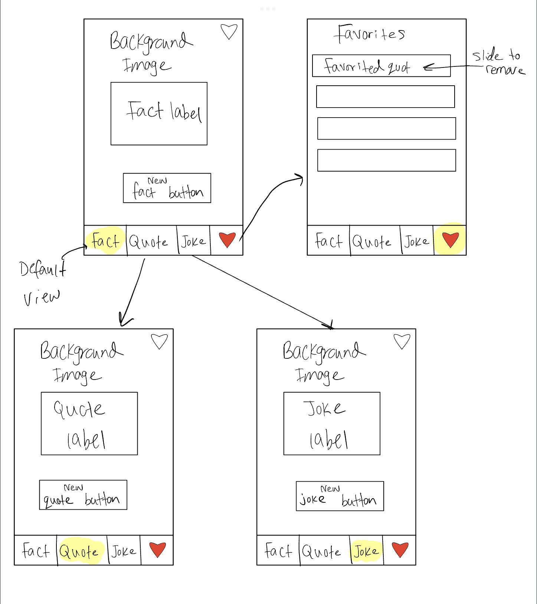

[//]: # (Original App Design Project - README Template
[comment]: # ===)

# FactFlict

## Table of Contents

1. [Overview](#Overview)
2. [Product Spec](#Product-Spec)
3. [Wireframes](#Wireframes)
4. [Schema](#Schema)

## Overview

### Description

An app that contains 3 main pages, a random quote, joke, or fact generator using public APIs

### App Evaluation

[//]: #  ([Evaluation of your app across the following attributes])
- **Category:** Education / Entertainment
- **Mobile:** Mobile only
- **Story:** An app that contains 3 main pages, a random quote, joke, or fact generator
- **Market:**  Can be used by anyone
- **Habit:** N/A
- **Scope:** Initially this app will only include the ability to generate random quotes/jokes/facts from an API, and the next version(s) will allow users to favorite and store quotes, customize the category of quotes obtained, and possibly change the background of each page

## Product Spec

### 1. User Stories (Required and Optional)

**Required Must-have Stories**

[//]: # ([fill in your required user stories here])
* 4 tabs in the bottom of the screen sginifying different parts/views of the app (including favorites)
* Different bakcgrounds for each view
* Ability to save favorites
* Ability to generate random quotes/jokes/facts

**Optional Nice-to-have Stories**

* Custom or changing backgrounds after each generation
* Ability to change the fonts
* Ability to customize the category or topic of each joke/fact/quote

### 2. Screen Archetypes

- [x] Random Fact Screen
* A random fact is automatically generated upon opening the view
* User is able to tap to generate a new random fact
* A favorite button is shown on the screen to bookmark
- [X] Random Quote Screen
* A random quote is automatically generated upon opening the view
* User is able to tap to generate a new random quote
* A favorite button is shown on the screen to bookmark
- [X] Random Joke Screen
* A random joke is automatically generated upon opening the view
* User is able to tap to generate a new random joke
* A favorite button is shown on the screen to bookmark

### 3. Navigation

**Tab Navigation** (Tab to Screen)

* Random fact
* Random quote
* Random joke
* favorites

**Flow Navigation** (Screen to Screen)

- Tapping on a favorited quote in "Favorites" screen displays a detailed screen on the full quote

## Wireframes

## Schema 

[This section will be completed in Unit 9]

### Networking

[comment]: #  - [Add list of network requests by screen ]
[comment]: #  - [Create basic snippets for each Parse network request]
[comment]: #  - [OPTIONAL: List endpoints if using existing API such as Yelp]

- Will be using the 3 different APIs for each topic
- User will be able to have some customization of the API requests

### Progress For Week 8

- Added wireframe
- Found suitable APIs 
- Create basic UI layout, still missing the dropdown menus for API request customization
- Add background color to distinguish different views and set a mood for each topic

### Week 8 demo video

    
    
  

### Progress For Week 9

- Added display of quote/joke/fact when app/view starts via API requests
- User can tap on a text to display the next text
- User is able to save a text to favorites
- Favorited text persists through app restarts
- Ability to delete text from favorites screen
- Added app icon

### Week 9 demo vide

    
    
  

